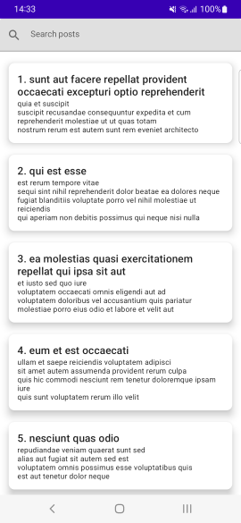
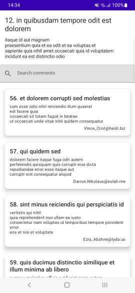
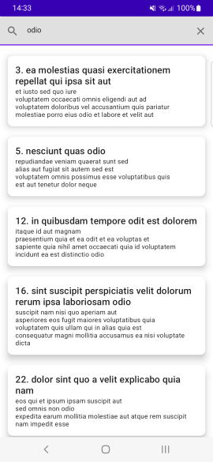
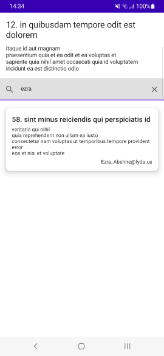

# Android-MVVM-App

A simple native Android MVVM app which displays posts and associated comments.

The data are fetched from https://jsonplaceholder.typicode.com/ and saved to local Room Database.

 

Posts and comments can be searched.

 

# Technologies used

- Kotlin
- Jetpack Compose
- Retrofit
- Dagger Hilt
- Room Database
